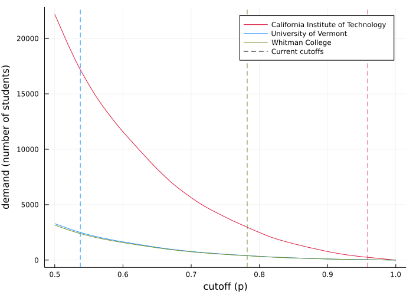

# Admissions markets with multinomial logit choice and single scoring

Max Kapur | [maxkapur.com](https://www.maxkapur.com/)

The code in this repository is the basis for the paper "Characterizing nonatomic admissions markets," [whose beta version is available on arXiv at this link](https://arxiv.org/abs/2107.01340). The abstract is as follows.

>This article proposes a characterization of admissions markets that can predict the distribution of students at each school or college under both centralized and decentralized admissions paradigms. The characterization builds on recent research in stable assignment, which models students as a probability distribution over the set of ordinal preferences and scores. Although stable assignment mechanisms presuppose a centralized admissions process, I show that stable assignments coincide with equilibria of a decentralized, iterative market in which schools adjust their admissions standards in pursuit of a target class size. Moreover, deferred acceptance algorithms for stable assignment are a special case of a well-understood price dynamic called tâtonnement. The second half of the article turns to a parametric distribution of student types that enables explicit computation of the equilibrium and is invertible in the schools' preferability parameters. Applying this model to a public dataset produces an intuitive ranking of the popularity of American universities and a realistic estimate of each school's demand curve, and does so without imposing an equilibrium assumption or requiring the granular student information used in conventional logistic regressions. 

I continue to update the paper, whose `.tex` file and figures are available in the `/paper/` directory.

This repository also contains work in progress on modeling schools' objective functions and inverse-optimizing for their parameters. 